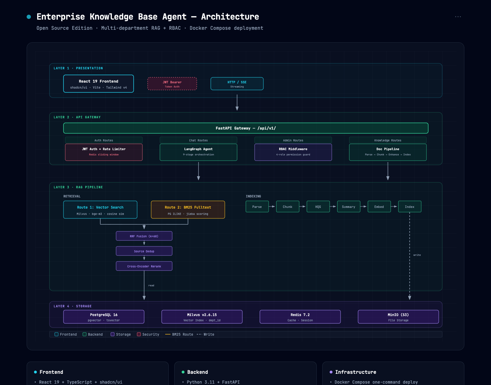
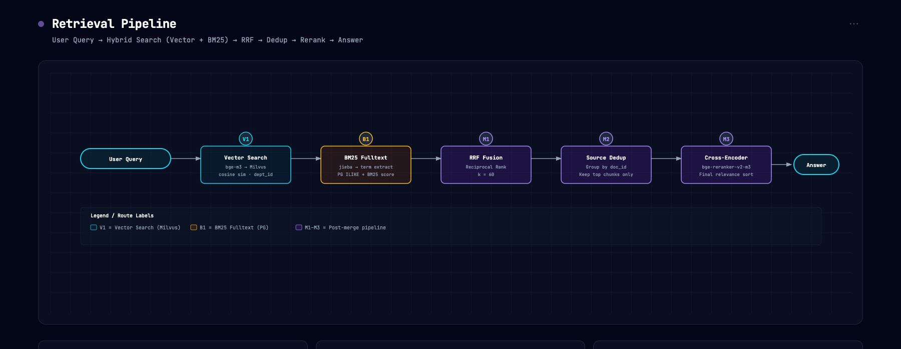
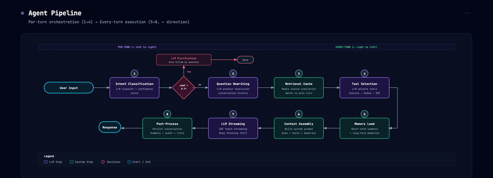

# Architecture Deep Dive

This document describes the architecture of the **Open Source Edition**.

---

## Table of Contents

1. [System Architecture Overview](#1-system-architecture-overview)
2. [Multi-Department Data Isolation](#2-multi-department-data-isolation)
3. [RAG Pipeline](#3-rag-pipeline)
4. [Agent Pipeline](#4-agent-pipeline)
5. [Memory System](#5-memory-system)
6. [Security Model](#6-security-model)
7. [API Contract Architecture](#7-api-contract-architecture)
8. [Key Design Decisions](#8-key-design-decisions)

---

## 1. System Architecture Overview

> **Interactive diagram**: [architecture-overview.html](architecture-overview.html) (open in browser, export as PNG/PDF using the built-in toolbar)
> 
> 

```
┌─────────────────────────────────────────────────────────┐
│                    React 19 Frontend                    │
│           Shadcn Admin · Vite · Tailwind v4             │
│                   [JWT Bearer Token]                    │
└────────────────────────────┬────────────────────────────┘
                             │ HTTP / SSE
┌────────────────────────────▼─────────────────────────────┐
│                    FastAPI Gateway                       │
│  ┌──────────┬──────────┬──────────┬───────────────────┐  │
│  │   Auth   │  Chat    │ Admin    │    Knowledge      │  │
│  │  Routes  │  Routes  │ Routes   │    Routes         │  │
│  └────┬─────┴────┬─────┴────┬─────┴────────┬──────────┘  │
│       │          │          │              │             │
│  ┌────▼────┐┌────▼─────┐┌───▼─────┐┌────────▼────────┐   │
│  │ JWT Auth││ LangGraph││ RBAC    ││ Doc Pipeline    │   │
│  │ + Rate  ││ State    ││ Middle- ││ (parse → chunk  │   │
│  │ Limiter ││ Machine  ││ ware    ││ → index)        │   │
│  └─────────┘└──────────┘└─────────┘└─────────────────┘   │
└────────────────────────────┬─────────────────────────────┘
                             │
┌────────────────────────────▼────────────────────────────┐
│                      RAG Pipeline                       │
│  Parse → Chunk → HQG → Summary → Embed → Index          │
│  Retrieve (Vector + Fulltext) → Fuse → Rerank           │
└────────────────────────────┬────────────────────────────┘
                             │
┌────────────────────────────▼────────────────────────────┐
│                     Storage Layer                       │
│  ┌──────────┐ ┌──────────┐ ┌────────────┐ ┌──────────┐  │
│  │PostgreSQL│ │  Milvus  │ │   Redis    │ │   MinIO  │  │
│  │  16      │ │ v2.6.15  │ │   7.2      │ │   (S3)   │  │
│  │ Business │ │  Vector  │ │ Cache+     │ │   File   │  │
│  │ Data     │ │  Index   │ │ Session    │ │  Storage │  │
│  └──────────┘ └──────────┘ └────────────┘ └──────────┘  │
└─────────────────────────────────────────────────────────┘
```

### Layer Responsibilities

| Layer | Responsibility |
|-------|---------------|
| **Frontend** | UI rendering, state management, JWT token handling, SSE consumption |
| **Gateway** | Request routing, authentication, authorization, rate limiting, CORS |
| **Chat Engine** | Intent classification, multi-turn conversation orchestration (LangGraph) |
| **RAG Engine** | Document parsing, chunking, indexing, multi-route retrieval, re-ranking |
| **Storage** | Persistent data, vector indices, cache, file storage |

### Data Flow: Query

```
User Input
  │
  ▼
Frontend → API Gateway (JWT validate + RBAC check)
  │
  ├── Step 1: Intent Classification (LLM classify + confidence)
  │   └── confidence < 0.7 → LLM clarification → Done
  │
  ├── Step 2: Question Rewriting (LLM pronoun resolution)
  │
  ├── Step 3: Retrieval Cache Check (Redis cosine-similarity)
  │   └── Cache hit → inject cached chunks from previous turn
  │
  ├── Step 4: Tool Selection (LLM decides which tools to call)
  │   ├── retrieve_knowledge → execute → Source Dedup → emit SSE
  │   ├── query_documents → execute → save doc context to Redis
  │   ├── get_current_time → execute
  │   └── LLM chose no tools → jieba entity check → force retrieval
  │
  ├── Step 5: Memory Load (short-term summary + long-term memories)
  │
  ├── Step 6: Context Assembly (build system prompt)
  │
  ├── Step 7: LLM Streaming (SSE, optional deep thinking / CoT)
  │
  ├── Step 8: Title Generation (auto via LLM, first message only)
  │
  └── Step 9: Post-Process (persist conversation, audit log)
```

### Data Flow: Document Upload

```
Upload → API (MIME check + MD5) → MinIO (raw storage)
  → PG (document record, status=pending)
  → Queue (in-memory or RabbitMQ) → Worker
    → Parse (MinerU/PyMuPDF)
    → Chunk (semantic + heading tracking)
    → Enhance (HQG + summary via LLM)
    → Embed (bge-m3 → Milvus, routed by dept_id)
    → PG (status=ready, chunk records, tsvector update)
```

---

## 2. Multi-Department Data Isolation

### Problem

Enterprise systems require strict data isolation between departments. A user in the R&D department must never see documents from the HR department, and vice versa.

### Solution: Milvus Partition + Field Isolation

Milvus uses a **field-level isolation model**: vectors are stored in a shared collection but filtered by `dept_id`.

```
Collection: knowledge_chunks

Within the collection:
├── Record {dept_id: "d1", ...}   ←  Department A
├── Record {dept_id: "d2", ...}   ←  Department B
└── ...

Search = field(dept_id) filter
```

**Department isolation:** Vectors are filtered by `dept_id` field expression:

```python
# Search — dept_id field filter
search_params = {
    "expr": f"dept_id in ['{dept_id}']",
    "limit": top_k,
}
```

### What About Admin?

Admins have `dept_id = None` and global access — their searches skip the dept filter:

```python
if current_user.is_super_admin:
    search_params = {"limit": top_k}  # All departments
else:
    search_params = {
        "expr": f"dept_id in [{user_dept_ids}]",
        "limit": top_k,
    }
```

### Database-Level Isolation

Isolation is enforced at three levels:

| Layer | Mechanism | Scope |
|-------|-----------|-------|
| **API** | RBAC middleware | What actions a user can perform |
| **Vector** | Milvus field filter | Which vector data a user can search |
| **Application** | SQL `WHERE dept_id = ?` | Which records a user can read |
| **File** | MinIO path prefix (`raw/{dept_id}/`) | Which files a user can access |

---

## 3. RAG Pipeline

### Enhanced Indexing Pipeline

Documents go through a multi-stage pipeline designed for high-quality retrieval:

```
Upload (.pdf/.docx/.xlsx/.pptx/.md/.txt/.msg/.eml/.png/.jpg)
  │
  ▼
[Parser] — MinerU for PDFs (structural extraction with layout analysis)
           PyMuPDF for text PDFs
           LlamaIndex readers for Office formats (DOCX/XLSX/PPTX)
           Native parser for TXT/MD/CSV
           email library for MSG/EML
           OCR for scanned images (JPG/PNG/BMP/TIFF)
  │
  ▼
[Chunker] — Semantic splitting:
            - Split by headings (## / ###)
            - Track heading_path: "Doc > Section > Subsection"
            - Merge small paragraphs below min_chunk_size
            - Cross-page merge for continued paragraphs
  │
  ▼
[Indexing Engine] — For each chunk, in parallel (3s timeout):
            ├── Summary: LLM generates a concise summary
            └── HQG: LLM generates hypothetical questions the chunk could answer
  │
  ▼
[Milvus] — Embed via bge-m3 (1024d) → Insert with dept_id filter
  │
  ▼
[PostgreSQL] — Write chunk content + heading_path + page_range
               Trigger: UPDATE content_tsv (tsvector for fulltext search)
               Status: ready
```

### Retrieval Pipeline

> **Process diagram**: [retrieval-pipeline.html](retrieval-pipeline.html) — interactive flowchart
> 
> 

At query time, two parallel routes execute:

```
                           User Query
                              │
                ┌─────────────┴─────────────┐
                │                           │
    ┌───────────▼───────────┐   ┌───────────▼───────────┐
    │  Route 1: Vector      │   │  Route 2: BM25        │
    │  (Milvus)             │   │  (PostgreSQL ILIKE)   │
    │                       │   │                       │
    │  1. Embed query via   │   │  1. jieba segment +   │
    │     bge-m3 (1024d)    │   │     stop-word removal │
    │  2. dept_id filter    │   │  2. Term extraction   │
    │  3. Cosine similarity │   │     (phrase + terms)  │
    │     top-K             │   │  3. ILIKE match +     │
    │                       │   │     BM25 scoring      │
    └───────────┬───────────┘   └───────────┬───────────┘
                │                           │
                └─────────────┬─────────────┘
                              │
                     ┌────────▼────────┐
                     │  RRF Fusion     │
                     │  (k=60)         │
                     └────────┬────────┘
                              │
                     ┌────────▼────────┐
                     │  Source Dedup   │
                     │  Keep top doc's │
                     │  chunks only    │
                     └────────┬────────┘
                              │
                     ┌────────▼────────┐
                     │  Cross-Encoder  │
                     │  Re-rank        │
                     │  (bge-reranker) │
                     └────────┬────────┘
                              │
                     ┌────────▼────────┐
                     │  Top-K Results  │
                     │  → Context      │
                     │  → LLM          │
                     └─────────────────┘
```

### Why Two Routes?

| Route | Strength | Weakness |
|-------|----------|----------|
| **Vector** | Semantic understanding, handles paraphrasing | Misses exact keyword matches |
| **Fulltext (BM25)** | Exact keyword match, proper nouns, codes | No semantic understanding |

The two routes complement each other. RRF fusion ensures that documents appearing in multiple result sets are boosted. Source dedup eliminates noise by surfacing only the most relevant document. Cross-Encoder re-ranking provides the final quality gate.

---

## 4. Agent Pipeline

> **Process diagram**: [agent-pipeline.html](agent-pipeline.html) — interactive flowchart
> 
> 

The chat module uses an **orchestrated pipeline** (LangGraph state graph + explicit `run_agent()` orchestration). The pipeline has 9 stages:

```
                           User Input
                              │
                              ▼
              ┌───────────────────────────────┐
              │  Step 1: Intent Classification│
              │  LLM classifies intent +      │
              │  assigns confidence score     │
              └───────────────┬───────────────┘
                              │
                    ┌─────────▼──────────┐
                    │  confidence < 0.7? │
                    └─────┬──────────┬───┘
                          │ No       │ Yes
                          │      ┌───▼───────────────────┐
                          │      │  LLM Clarification    │
                          │      │  Auto-generate        │
                          │      │  follow-up question   │
                          │      └──────────┬────────────┘
                          │                 │
                          │              [Done]
                          │
              ┌───────────▼───────────────┐
              │  Step 2: Question         │
              │  Rewriting                │
              │  LLM resolves pronouns    │
              │  against conversation     │
              │  history                  │
              └───────────┬───────────────┘
                          │
              ┌───────────▼───────────────┐
              │  Step 3: Retrieval Cache  │
              │  Redis cosine-similarity  │
              │  match vs previous turn   │
              │  ┌── Hit ────► inject     │
              │  └── Miss ───► continue   │
              └───────────┬───────────────┘
                          │
              ┌───────────▼───────────────┐
              │  Step 4: Tool Selection   │
              │  LLM decides which tools  │
              │  to call (JSON output):   │
              │                           │
              │  ┌─ retrieve_knowledge    │
              │  ├─ query_documents       │
              │  ├─ get_current_time      │
              │  └─ (none)──► jieba       │
              │       entity check──►     │
              │       force retrieval     │
              │                           │
              │  Execute tools → Source   │
              │  Dedup → Emit retrieval   │
              │  SSE event                │
              └───────────┬───────────────┘
                          │
              ┌───────────▼───────────────┐
              │  Step 5: Memory Load      │
              │  Short-term summary       │
              │  (Redis) + long-term      │
              │  memories (PG)            │
              └───────────┬───────────────┘
                          │
              ┌───────────▼───────────────┐
              │  Step 6: Context Assembly │
              │  Build system prompt:     │
              │  base + tools output +    │
              │  memories + search        │
              │  results + guardrails     │
              └───────────┬───────────────┘
                          │
              ┌───────────▼───────────────┐
              │  Step 7: LLM Stream       │
              │  SSE streaming:           │
              │  ┌─ thinking (deep mode)  │
              │  └─ token                 │
              └───────────┬───────────────┘
                          │
              ┌───────────▼───────────────┐
              │  Step 8: Title Generation │
              │  LLM auto-generates       │
              │  session title (first     │
              │  message only)            │
              └───────────┬───────────────┘
                          │
              ┌───────────▼───────────────┐
              │  Step 9: Post-Process     │
              │  Persist conversation,    │
              │  generate summary, write  │
              │  audit log                │
              └───────────────────────────┘
```

### Intent Classification

Six intent categories:

| Intent | Action |
|--------|--------|
| `knowledge_query` | Retrieve from knowledge base, then generate |
| `general_chat` | Skip retrieval, direct LLM response |
| `document_task` | Query documents info |
| `harmful` | Guardrail triggered, LLM decides response |
| `out_of_scope` | Guardrail triggered, LLM decides response |
| `sensitive_topic` | Guardrail triggered, LLM decides response |

Each intent carries a **confidence score**. When confidence < 0.7, the system asks for clarification rather than guessing.

### Guardrail System

Guardrails check intent-based safety flags:

```python
GUARDRAIL_MAP = {
    "harmful":       ["harmful", "safety"],
    "out_of_scope":  ["out_of_scope"],
    "sensitive_topic": ["sensitive"],
}
```

Flagged intents inject safety instructions into the system prompt. Tool results override guardrails — if the LLM selected a tool, the response is treated as legitimate even if the intent was flagged.

### SSE Event Stream

The response is delivered as a Server-Sent Events stream:

```
POST /api/v1/chat/message
Accept: text/event-stream

event: intent
data: {"intent": "knowledge_query", "reasoning": "..."}

event: retrieval
data: {"chunks": [...], "queried_doc_ids": [...]}

event: thinking              (deep thinking mode only)
data: {"text": "Let me analyze this step by step..."}

event: token
data: {"text": "根据"}

event: token
data: {"text": "知识库记录，"}

event: token
data: {"text": "Project Alpha 由张伟负责。"}

event: done
data: {"message_id": "...", "session_id": "...", "usage": {}}
```

---

## 5. Memory System

### Short-Term Memory (Session Context)

- **Storage**: Redis AOF (Append-Only File) for crash recovery
- **Structure**: 
  - `session:{id}:messages` — List of recent N messages
  - `session:{id}:summary` — Condensed summary (regenerated at token threshold)
- **TTL**: 30-minute sliding window (reset on each user interaction)
- **Summary Trigger**: When total tokens exceed 75% of context window

### Long-Term Memory (Cross-Session)

- **Storage**: PostgreSQL `user_memories` table
- **Extraction**: LLM evaluates each user message for "worth remembering" facts
- **Retrieval**: Semantic search via bge-m3 embedding on memory content
- **Write Strategy**: Async background task, non-blocking to main flow

### Conversation History

- Stored in PostgreSQL with `metadata` JSONB field
- Supports soft-delete per-message
- Title auto-generated by LLM on first message

---

## 6. Security Model

### RBAC Architecture

```
User → Role → Permission
  │       │        └── resource:action (e.g., "document:upload")
  │       └── Scoped by dept_id
  └── Bound to department
```

### Role Hierarchy

| Role | Knowledge Base | QA | System Settings | User Management |
|------|---------------|-----|-----------------|-----------------|
| **admin** | All depts | Available | Full | Full |
| **dept_admin** | Own dept CRUD | Available | Limited | Own dept |
| **dept_editor** | Own dept CRUD | Available | — | — |
| **dept_viewer** | Own dept read-only | Available | — | — |

### Permission Enforcement

```python
# Decorator-based at route level
@router.post("/documents")
@require_permission("document:upload")
async def upload_document(...):
    ...

# Role-based at middleware level
@router.delete("/admin/users/{id}")
@require_role(["admin", "dept_admin"])
async def delete_user(...):
    ...
```

### Security Measures

| Measure | Implementation |
|---------|---------------|
| **Authentication** | JWT Bearer tokens, periodic key rotation |
| **Password** | bcrypt hashing |
| **Rate Limiting** | Redis sliding window per user + per IP |
| **File Upload** | MIME type validation, 50 MB limit, executable rejection |
| **Brute Force** | Account lockout after N failed attempts (configurable) |
| **CORS** | Whitelist-based origin validation |
| **Audit** | All operations logged with trace_id |
| **SQL Injection** | ORM-only queries (SQLAlchemy) |
| **Logging** | Structured JSON, no sensitive data in logs |

---

## 7. API Contract Architecture

### Design Goal

The frontend should be fully reusable with a different backend implementation (e.g., Java/Spring Boot).

### How It Works

```
React Frontend
  │
  ├──► http://api-server/api/v1/...  ← OpenAPI Contract
  │
  ├──► FastAPI Backend (current)
  └──► Java Backend (future)
```

### Contract Boundaries

| Concern | Frontend | Backend |
|---------|----------|---------|
| Routing | react-router-dom | FastAPI routes |
| State | Zustand stores | — |
| Auth | JWT storage + Bearer header | JWT generation + validation |
| Data | Renders from API responses | SQLAlchemy models |
| Business Logic | UI state only | Core domain logic |
| Storage | — | All databases |

### API Conventions

```
Base URL: /api/v1/
Format: JSON
Auth: Bearer JWT
Response: {code, message, data, meta}
Errors: {code, message, detail}
Pagination: {page, page_size, total, items}
```

This contract-first approach means:
- Frontend team and backend team can work in parallel
- Backend can be rewritten without touching UI
- API changes are explicitly versioned

---

## 8. Key Design Decisions

### Why Monolith, Not Microservices?

| Factor | Monolith | Microservices |
|--------|----------|---------------|
| Deployment complexity | One service | Multiple services |
| Development speed | Faster iteration | Coordination overhead |
| Team size | Single team | Multiple teams required |
| API contract migration | Easy (in-process) | Requires API gateway |

**Decision**: Start with a well-structured monolith with clear module boundaries. The API contract layer ensures frontend-backend decoupling. If scaling requires it, modules can be extracted into independent services.

### Why Milvus Over PGVector?

| Factor | Milvus | PGVector |
|--------|--------|----------|
| Performance at scale | Optimized for 100M+ vectors | Degrades at high volume |
| Feature set | Rich index types, scalar filtering | Basic vector operations |
| Deployment complexity | Requires separate service | In-database |

**Decision**: Milvus for production deployments requiring hard isolation. PGVector is available as a simpler alternative for smaller deployments.

### Why LangGraph Over LangChain Agent?

| Factor | LangGraph | LangChain Agent |
|--------|-----------|-----------------|
| State control | Explicit state machine | Implicit tool selection |
| SSE streaming | Fine-grained control | Coarse-grained |
| Debugging | Deterministic node execution | Non-deterministic |
| Intent routing | Custom classification | LLM-driven tool selection |

**Decision**: LangGraph's explicit state machine provides better control, predictability, and SSE event emission — critical for an enterprise QA system.

### Why RRF + Cross-Encoder Over Learned Ranking?

| Factor | RRF + Cross-Encoder | Learned Ranking |
|--------|---------------------|-----------------|
| Implementation | Simple, zero training | Requires training data |
| Quality | Competitive with learned methods | Potentially better with sufficient data |
| Maintenance | No model updates | Requires periodic retraining |
| Cold start | Works immediately | Requires historical data |

**Decision**: RRF + Cross-Encoder provides excellent results with zero training overhead. Can be replaced with a learned ranker if query volume and training data grow.

---

## Appendix: Terminology

| Term | Meaning |
|------|---------|
| **asyncio** | Python built-in library for **async/await** concurrency. Single-threaded, cooperative multitasking — one thread handles many I/O operations by yielding control during waits (network, DB, file). Equivalent to Java NIO / Kotlin coroutines. |
| **Uvicorn** | ASGI server for Python. Launches **worker processes** (multi-core) with each process running an asyncio event loop. Comparable to Tomcat (servlet container) for Java. |
| **GIL** | Global Interpreter Lock — CPython's mechanism that allows only one thread to execute Python bytecode at a time. Makes CPU-bound threading pointless, but I/O-bound async code excels. |
| **ASGI** | Asynchronous Server Gateway Interface — the async successor to WSGI. Allows long-lived connections (SSE, WebSocket). |
| **LangGraph** | LangChain extension for building **state machines** instead of chains. Nodes = processing steps, edges = transitions. Supports cycles, branching, and persistent state. |
| **SSE** | Server-Sent Events — HTTP-based streaming protocol for pushing server-to-client data. Simpler than WebSocket (unidirectional, text-only, native browser `EventSource`). |
| **MinerU** | Document parsing tool by the PDF-Extract-Kit team. Handles complex PDF layouts (tables, columns, headers) with layout detection + OCR. |
| **HQG** | Hypothetical Question Generation — LLM generates questions that a document chunk could answer, then those questions are indexed alongside the chunk for improved retrieval recall. |
| **RRF** | Reciprocal Rank Fusion — merge algorithm that combines multiple ranked lists by summing reciprocal ranks. Simple, parameter-free, and competitive with learned fusion. |
| **bge-m3** | BAAI General Embedding model (1024 dimensions). Strong on Chinese + English + multilingual, supports dense + sparse + multi-vector retrieval. |
| **tsvector** | PostgreSQL's built-in fulltext search type. Converts text to lexeme arrays for fast BM25-style ranking via `ts_rank()`. |
